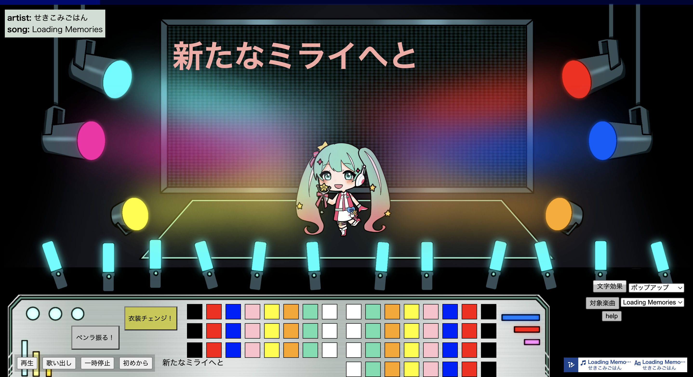

# magical-live-operator

マジカル ライブ オペレーター

マジカルミライのようなスクリーンに歌詞が流れるライブ会場です。
手前のオペレーション卓を使って照明やミクの衣装などを自分好みに操作できます。
自分だけのライブを演出してみましょう。

 


API チュートリアル「1. 開発の始め方」のサンプルコードを参考にしています。
- サンプルコードのデモページ: https://textalivejp.github.io/textalive-app-basic/

## 開発

[Node.js](https://nodejs.org/) をインストールしている環境で以下のコマンドを実行すると、開発用サーバが起動します。

```sh
npm install
npm run dev
```

## ビルド

以下のコマンドで `docs` 以下にビルド済みファイルが生成されます。 [サンプルコードのデモページ](https://textalivejp.github.io/textalive-app-basic/) は [GitHub Pages](https://pages.github.com/) で、このリポジトリの `docs` 以下のファイルが提供されています。

```sh
npm run build
```

## 対応楽曲(6曲)
・Loading Memories / せきこみごはん feat. 初音ミク
・青に溶けた風船 / シアン・キノ feat. 初音ミク
・歌の欠片と / imo feat. MEIKO
・未完のストーリー / 加賀（ネギシャワーP） feat. 初音ミク
・みはるかす / ねこむら（cat nap） feat. 初音ミク
・fear / 201 feat. 初音ミク

## 開発担当
星日かる

## 使用画像素材等
星日かる(自作)

## TextAlive App API


TextAlive App API は、音楽に合わせてタイミングよく歌詞が動くWebアプリケーション（リリックアプリ）を開発できるJavaScript用のライブラリです。

TextAlive App API について詳しくはWebサイト [TextAlive for Developers](https://developer.textalive.jp/) をご覧ください。

---
https://github.com/TextAliveJp/textalive-app-basic
